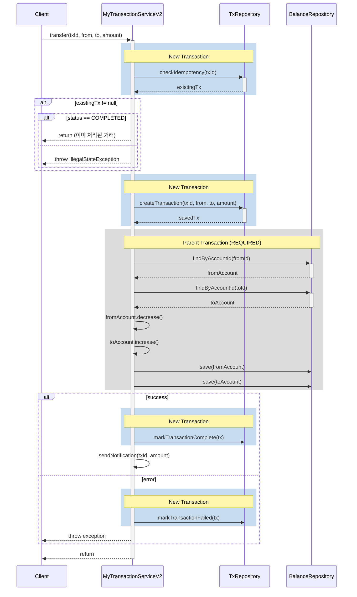

# 다양한 서비스 로직 구현 전략
목표:
- 잔액의 무결성 보장
- 거래의 멱등성 보장
- 비동기 통보 이메일 발송(학습 목적 코드이므로 실제로는 2초 지연 후 로그 출력)

## 트랜잭션 스크립트 패턴 (private 메소드 호출)
### transfer 메소드 흐름

```
transfer (@Transactional)
    └── checkIdempotency (@Transactional(REQUIRES_NEW))
    └── createTransaction (@Transactional(REQUIRES_NEW))
    └── executeTransfer (@Transactional(REQUIRED))
    └── markTransactionComplete (@Transactional(REQUIRES_NEW))
```

각 단계별 트랜잭션 동작:

checkIdempotency (REQUIRES_NEW)

부모 트랜잭션과 완전히 독립된 새로운 트랜잭션 시작
멱등성 체크가 완료되면 즉시 커밋
실패해도 부모 트랜잭션에 영향 없음

createTransaction (REQUIRES_NEW)

다시 새로운 트랜잭션으로 거래 기록 생성
거래 생성이 완료되면 즉시 커밋
이후 단계가 실패해도 거래 기록은 보존됨

executeTransfer (REQUIRED)

부모 트랜잭션에 참여 (같은 트랜잭션 컨텍스트 공유)
잔액 변경 작업 수행
낙관적 락 충돌이 여기서 발생
실패하면 부모 트랜잭션과 함께 롤백

markTransactionComplete (REQUIRES_NEW)

또 다른 독립된 트랜잭션으로 거래 상태 업데이트
상태 업데이트가 완료되면 즉시 커밋
만약 이전 단계에서 실패했다면 실행되지 않음

## 다이어그램



## 퍼사드 패턴
```
TransferFacade
   ├── IdempotencyChecker (REQUIRES_NEW)
   ├── TransactionCreator (REQUIRES_NEW)
   ├── TransferExecutor (REQUIRED)
   └── TransactionStatusManager (REQUIRES_NEW)
```

## 스프링 이벤트
```
@TransactionalEventListener
- TransactionCreatedEvent
- TransferCompletedEvent
- TransferFailedEvent
```
## axon 이벤트 소싱
```
Commands:
- CreateTransactionCommand
- ExecuteTransferCommand
- CompleteTransactionCommand

Events:
- TransactionCreatedEvent
- TransferExecutedEvent
- TransactionCompletedEvent
```

# 결론

개발의 흐름을 먼저 `@Transactional`, `@Transactional(propagation = Propagation.REQUIRED)`,
`@Transactional(propagation = Propagation.REQUIRES_NEW)`를 함수 단위로 표현할 수 없다면 퍼사드, 스프링 이벤트, axon 이벤트
소싱은
모두 사상누각이 된다.

이벤트 기반 아키텍처로 발전하기 위해서는 트랜잭션 경계를 명확히 나누고 REQUIRES_NEW와 REQUIRED를 적용하는 것이 출발점이 된다.

## 트랜잭션 독립성 보장

- REQUIRES_NEW로 분리된 트랜잭션은 실패해도 다른 트랜잭션에 영향을 주지 않음
- 각 이벤트가 독립적으로 처리될 수 있는 기반이 됨

## 이벤트 발행 시점 제어

- 각 트랜잭션이 커밋되는 시점에 이벤트 발행 가능
- REQUIRES_NEW로 분리된 트랜잭션은 즉시 커밋되므로 이벤트도 즉시 발행 가능

## Saga 패턴 적용 용이

- 각 트랜잭션 단계가 분리되어 있어 보상 트랜잭션 구현이 쉬움
- 장애 발생 시 특정 지점부터 재시도 가능

## 이벤트 소싱을 위한 준비

- 각 단계가 독립적인 커맨드와 이벤트로 변환 가능
- 트랜잭션 경계가 곧 애그리거트 경계가 될 수 있음
